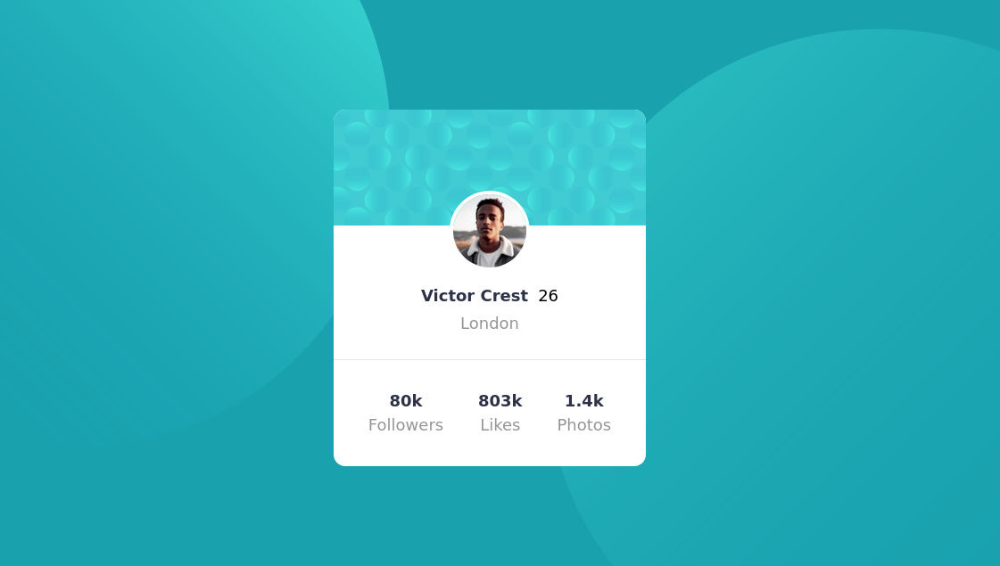

# Html & css  challenge  1 ✨

## Table of contents 🎓

- [Html \& css  challenge  1 ✨](#html--css--challenge--1-)
  - [Table of contents 🎓](#table-of-contents-)
  - [Overview ✨](#overview-)
    - [Screenshot 📷](#screenshot-)
    - [Links 🔗](#links-)
  - [My process](#my-process)
    - [Built with 🏗](#built-with-)
    - [What I learned 📕](#what-i-learned-)
    - [Useful resources 💻](#useful-resources-)
  - [Author 🐱](#author-)

## Overview ✨

### Screenshot 📷

### Links 🔗

- Solution URL: [page](https://www.frontendmentor.io/solutions/build-with-flex-box-EL9IxvozIE)
- Live Site URL: [page](https://sivin-wi.github.io/nft-preview-card-component-main/)

## My process

### Built with 🏗

- Semantic HTML5 markup
- Flexbox
- Media Queries

### What I learned 📕

1. Flex Box
2. Semantic Elements  
3. Media Queries

### Useful resources 💻

- [https://www.w3schools.com/](https://www.w3schools.com/) 
- [https://developer.mozilla.org/en-US/](https://developer.mozilla.org/en-US/)

## Author 🐱

- Frontend Mentor - [sivin](https://www.frontendmentor.io/profile/Sivin-Wi)